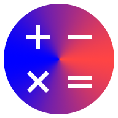
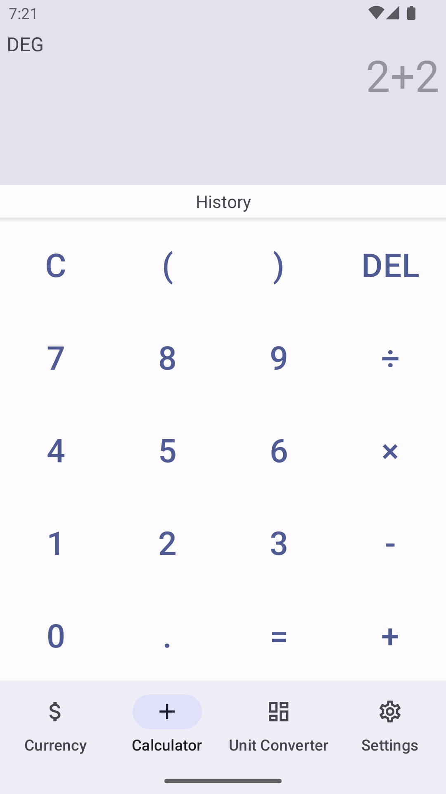
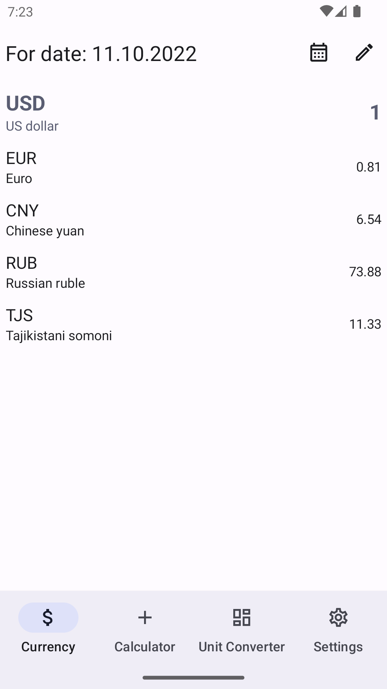
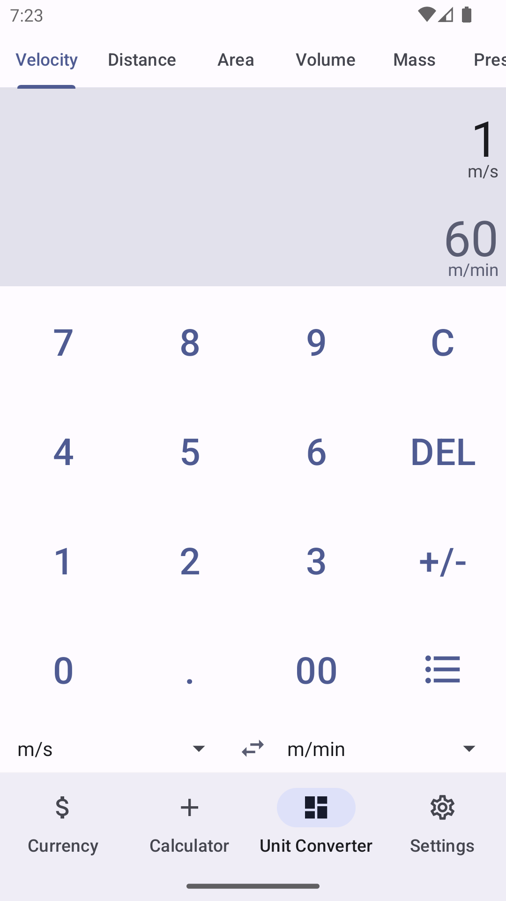
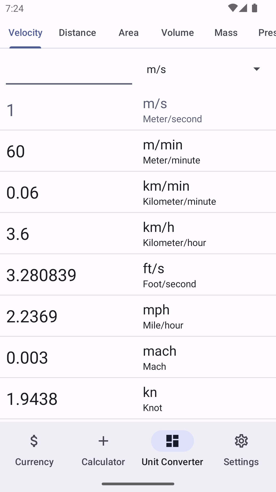
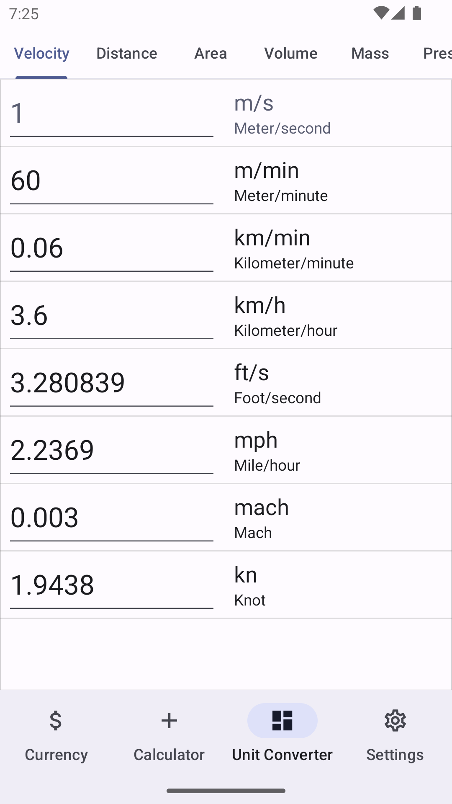
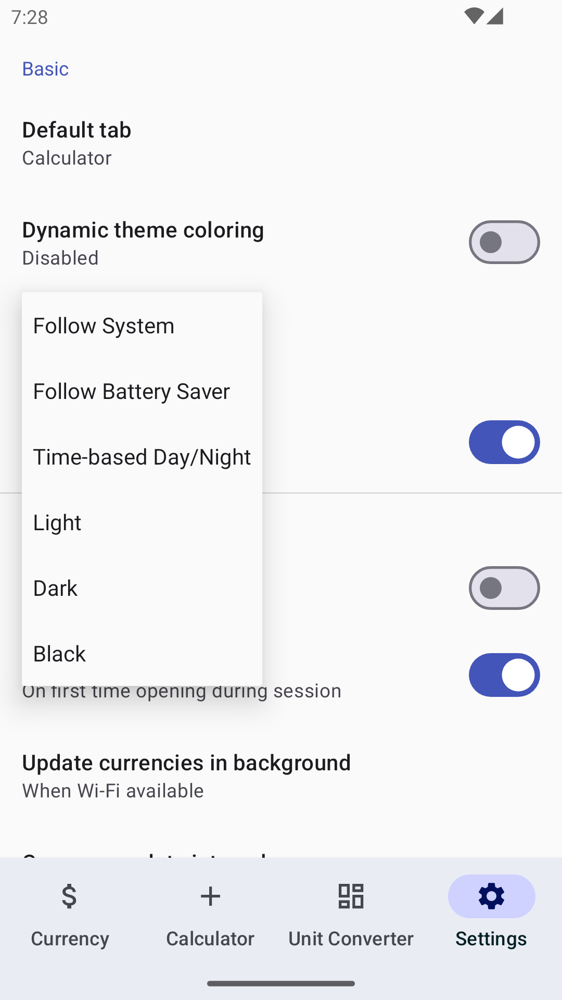

# Calculator

Android calculator app

## Screenshots

Click to show screenshots

## Features

* Calculator (yeah...)
  * Addition, subtraction, multiplication, division, brackets
  * Integer division, modulus, square root, power, percent, factorial
  * Trigonometry: sin, cos, lg, ln, tan, ctg. Degrees and radians
  * Constants: Pi, Euler, Golden ratio
  * Memory
* Currency converter
  * Based on data from Russian Central Bank
  * Data can be updated automatically in background
  * Date selection: from 07.1992 till present
  * Setting to show only currencies you interested in
* Unit converter
  * 3 appearances: simple, half-powerful, powerful
  * Categories:
    * Velocity: m/s, m/min, km/min, km/h, ft/s, mph, mach, kn
    * Distance: mm, cm, dm, m, km, in, ft, yd, mi, nmi, ly, arshin
    * Area: mm², cm², dm², m², km², a, ha, in², ft², yd², acre
    * Volume: mm³, cm³ (ml), dm³ (L), m³, in³, ft³, yd³, gal_uk, oz_uk, qt_uk, pt_uk, bbl
    * Mass: mg, g, kg, qq, t, gr, oz, lb, ct, u
    * Pressure: atm, at, Pa, hPa, kPa, bar, mmHg, mmWg, inHg, inWg, psi
    * Temperature: ˚C, ˚F, K, ˚Ra, ˚Ré

## Other features
* Material3-based app theming:
  * Follow System 
  * Follow Battery Saver
  * Time-based Day/Night (time can be changed)
  * Light
  * Dark
  * Black
* Selecting between Dark and Black in automatic (Follow System, Follow Battery Saver, Day/Night) themes
* Android 12+ Dynamic Colors
* Adaptive Icon && Android 13+ Themed Icon
* Startup screen selection:
  * Calculator
  * Currency converter
  * Unit converter
  * Last opened

## Used technologies, patterns, ...
* Started in Java, migrated to Kotlin
* MVVM
* Room
* Retrofit
* Part of UI uses Jetpack Compose in minApi21 version
* JUnit
* CI (unit testing and publishing releases)
* DI (started)

## TODOs
* DI (continue)
* CI (code style)
* More tests
* Bug fixes
* Upcoming Android features support (if any useful)

## Building

Current limitation: you cannot build both minApi16 and minApi21 versions at the same time due to AGP limitations on Compose settings.

To build release artifact create `local.properties` file in project root and add following properties:
* signing.storeFile - path to signature file
* signing.storePassword - signature file password
* signing.keyAlias - signature key name
* signing.keyPassword - signature key password
